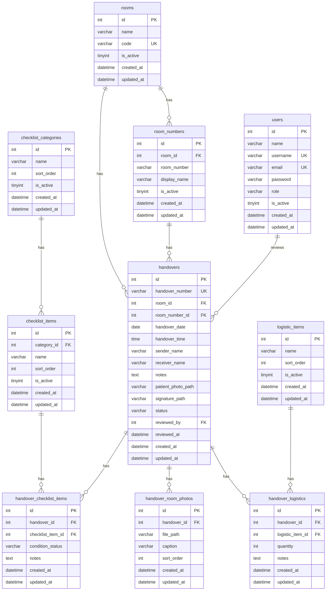

# Sistem Serah Terima Ruang Rumah Sakit

Membangun aplikasi web production-ready untuk serah terima kondisi ruang/kamar rumah sakit menggunakan **CodeIgniter 4 + Bootstrap 5 + MySQL/MariaDB**.

## User Review Required

> [!IMPORTANT]
> **Database Engine**: Rencana menggunakan MySQL/MariaDB. Apakah Anda sudah memiliki database server yang berjalan? Jika ya, berikan kredensial (host, port, database name, username, password).

> [!IMPORTANT]
> **PHP Version**: Pastikan PHP 8.1+ sudah terinstall beserta extensions: `intl`, `mbstring`, `json`, `mysqlnd`, `gd` (untuk image processing).

> [!IMPORTANT]
> **Composer**: Pastikan Composer sudah terinstall untuk setup project CI4.

## Open Questions

1. **Bahasa Tanda Tangan**: Apakah perlu 2 signature pad (satu untuk penyerah, satu untuk penerima), atau cukup 1 signature saja?
2. **Export/Print**: Apakah perlu fitur export PDF atau print untuk data serah terima di fase awal?
3. **Multi-Admin**: Apakah perlu fitur kelola banyak akun admin, atau cukup 1 admin saja di fase awal?
4. **Timezone**: Apakah timezone yang digunakan WIB (Asia/Jakarta)?

## Proposed Changes

Proyek akan dibangun dalam 8 fase sesuai requirement. Berikut detail teknis setiap komponen:

---

### PHASE 1: Foundation — Setup, Database, Models

#### [NEW] Project Setup via Composer
- `composer create-project codeigniter4/appstarter .` di workspace
- Konfigurasi `.env` untuk database, baseURL, environment
- Set timezone Asia/Jakarta

#### [NEW] Database Migrations (11 tabel)

| # | Tabel | Deskripsi |
|---|-------|-----------|
| 1 | `users` | Admin users with password hash |
| 2 | `rooms` | Master ruang (Nusa Indah, Melati, PRB, Flamboyan) |
| 3 | `room_numbers` | Kamar per ruang, FK → rooms |
| 4 | `checklist_categories` | Kategori checklist (6 kategori) |
| 5 | `checklist_items` | Item checklist (20 items), FK → categories |
| 6 | `logistic_items` | Master logistik (6 items) |
| 7 | `handovers` | Transaksi serah terima, unique handover_number |
| 8 | `handover_checklist_items` | Detail checklist per handover |
| 9 | `handover_room_photos` | Foto ruangan (multi), FK → handovers |
| 10 | `handover_logistics` | Detail logistik per handover |

Semua tabel menggunakan foreign key, index, dan constraint yang sesuai.

#### [NEW] Database Seeders
- `UserSeeder` — Admin default (admin/admin123, hashed)
- `RoomSeeder` — 4 ruang + kamar masing-masing
- `ChecklistSeeder` — 6 kategori + 20 items
- `LogisticSeeder` — 6 items logistik

#### [NEW] Models (10 model)
- `UserModel`, `RoomModel`, `RoomNumberModel`
- `ChecklistCategoryModel`, `ChecklistItemModel`
- `LogisticItemModel`, `HandoverModel`
- `HandoverChecklistItemModel`, `HandoverRoomPhotoModel`
- `HandoverLogisticModel`

Semua model menggunakan CI4 Model conventions dengan validation rules.

---

### PHASE 2: Authentication & Admin Layout

#### [NEW] `app/Filters/AdminAuthFilter.php`
- Check session `admin_logged_in`
- Redirect ke `/admin/login` jika belum login

#### [NEW] `app/Config/Filters.php`
- Register `adminAuth` filter
- Apply ke semua route `/admin/*` kecuali login

#### [NEW] `app/Controllers/Admin/AuthController.php`
- `login()` — GET form login
- `attemptLogin()` — POST authenticate
- `logout()` — GET destroy session

#### [NEW] `app/Views/layouts/admin.php`
- Bootstrap 5 admin layout
- Sidebar navigasi (collapsible di mobile)
- Navbar atas dengan info user & logout
- Content area

#### [NEW] `app/Views/admin/auth/login.php`
- Form login modern dengan Bootstrap

---

### PHASE 3: Master Data CRUD

#### [NEW] Admin Controllers (5 controller)

| Controller | URL | Fitur |
|-----------|-----|-------|
| `RoomController` | `/admin/rooms` | CRUD ruang |
| `RoomNumberController` | `/admin/room-numbers` | CRUD kamar |
| `ChecklistCategoryController` | `/admin/checklist-categories` | CRUD kategori |
| `ChecklistItemController` | `/admin/checklist-items` | CRUD item checklist |
| `LogisticController` | `/admin/logistics` | CRUD logistik |

#### [NEW] Admin Views (5 set views)
- Masing-masing: `index.php`, `create.php`, `edit.php`
- Tabel data dengan search & pagination
- Form create/edit dengan validasi
- Soft-delete protection (tidak bisa hapus jika sudah digunakan)

---

### PHASE 4: Form Perawat (Public)

#### [NEW] `app/Controllers/HandoverController.php`
- `index()` — Tampilkan form serah terima
- `save()` — Process & store handover
- `success($id)` — Halaman sukses

#### [NEW] `app/Controllers/Api/RoomController.php`
- `getRoomNumbers($roomId)` — JSON response kamar per ruang

#### [NEW] `app/Views/layouts/nurse.php`
- Layout mobile-first, tablet-optimized
- Warna navy/biru rumah sakit

#### [NEW] `app/Views/handovers/form.php`
- Section A: Informasi Serah Terima (dropdown dinamis)
- Section B: Checklist (tombol besar per status)
- Section C: Logistik (jumlah + keterangan)
- Section D: Foto Pasien (camera capture)
- Section E: Foto Ruangan (multi upload, preview)
- Section F: Catatan
- Section G: Signature Pad (Canvas)
- Section H: Pernyataan (checkbox konfirmasi)
- Section I: Tombol Reset & Submit

---

### PHASE 5: Upload & Signature

#### Upload Handler
- Foto pasien → `writable/uploads/handovers/patients/`
- Foto ruangan → `writable/uploads/handovers/rooms/`
- Signature → `writable/uploads/signatures/`
- Validasi MIME, extension, ukuran (max 5MB)
- Rename file dengan unique name

#### [NEW] Signature Pad JavaScript
- HTML5 Canvas dengan Pointer Events
- Support mouse, touch, stylus/Apple Pencil
- Tombol Clear & Undo
- Export ke PNG base64 saat submit
- Responsive canvas sizing

---

### PHASE 6: Transaction Processing

#### Handover Save Logic (Atomic)
```
BEGIN TRANSACTION
  1. Generate handover_number (STR-YYYYMMDD-XXXXX)
  2. INSERT handovers
  3. INSERT handover_checklist_items (bulk)
  4. Process & save patient photo
  5. Process & save room photos → INSERT handover_room_photos
  6. Process & save signature
  7. INSERT handover_logistics (bulk)
COMMIT (or ROLLBACK on failure)
```

#### Nomor Dokumen Generator
- Format: `STR-YYYYMMDD-XXXXX`
- Query MAX nomor hari ini + 1
- Unique constraint di database sebagai safety net
- Retry logic jika conflict

---

### PHASE 7: Admin Dashboard & Data Management

#### [NEW] `app/Controllers/Admin/DashboardController.php`
- Statistik: total hari ini, bulan ini, belum review, item bermasalah
- Serah terima terbaru (5-10 terakhir)
- Ringkasan item bermasalah (aggregate query)

#### [NEW] `app/Controllers/Admin/HandoverController.php`
- `index()` — List dengan filter, search, pagination
- `show($id)` — Detail lengkap
- `review($id)` — POST mark as reviewed

#### [NEW] Secure Media Controller
- `app/Controllers/Admin/MediaController.php`
- Route: `/admin/media/patient/{id}`, `/admin/media/room-photo/{id}`, `/admin/media/signature/{id}`
- Semua melewati AdminAuthFilter
- Serve file dari `writable/` directory

#### [NEW] Admin Views
- `dashboard/index.php` — Cards statistik, tabel terbaru, chart item bermasalah
- `handovers/index.php` — Tabel data + filter panel
- `handovers/show.php` — Detail lengkap dengan gallery foto (Bootstrap Modal)

---

### PHASE 8: Testing & Polish

- Validasi semua form (server-side + client-side feedback)
- Test responsive di breakpoints: 576px, 768px, 992px, 1200px
- Security review: CSRF, XSS, SQL Injection, file upload
- Error handling & user-friendly error messages
- Performance review (query optimization, indexing)

---

## Arsitektur Database (ERD)



## Tech Stack Summary

| Layer | Technology |
|-------|-----------|
| Backend | PHP 8.1+, CodeIgniter 4 |
| Database | MySQL 8 / MariaDB 10.4+ |
| Frontend | Bootstrap 5.3, HTML5, CSS3, Vanilla JS |
| Auth | CI4 Session + AdminAuthFilter |
| File Storage | `writable/uploads/` (protected) |
| Signature | HTML5 Canvas + Pointer Events |

## File Count Estimate

| Category | Approx. Files |
|----------|--------------|
| Migrations | 10 |
| Seeders | 5 |
| Models | 10 |
| Controllers | 12 |
| Views | ~35 |
| JS/CSS | ~5 |
| Config | 3 |
| **Total** | **~80 files** |

## Verification Plan

### Automated Tests
- `php spark migrate` — Verify all migrations run successfully
- `php spark db:seed` — Verify all seeders populate data
- Manual browser testing on each route

### Manual Verification
1. Buka form perawat di browser, isi semua field, submit → verify data tersimpan
2. Login admin, verify dashboard statistik
3. Verify filter/search/pagination pada data listing
4. Verify detail handover menampilkan semua data termasuk foto dan signature
5. Verify mark as reviewed functionality
6. Verify CRUD semua master data
7. Test responsive di iPad simulator (Chrome DevTools)
8. Verify file upload security (foto pasien tidak bisa diakses tanpa login)
